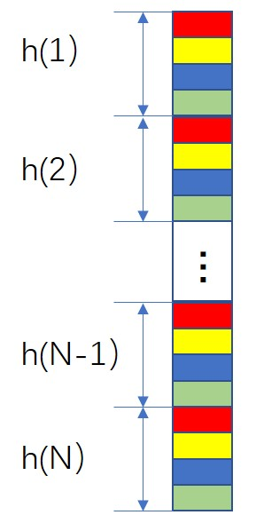

## AccDNN (Accelerator Core Compiler for Deep Neural Network)

### This project is also named as DNNBuilder in our academic research.

### Project Description:

In this project, we proposed a novel solution that can automatically convert the Caffe trained deep neural network to the FPGA RTL level implementation without involving any programming effort, and also provide uniform APIs to the users for their recognition task. Thus the developers, without any FPGA programming experience, can deploy their FPGA accelerated deep learning service in the data center or edge devices only providing their trained Caffe model. This work was published in ICCAD'18, and won the **Best Paper Award** for Front-end. For more design details. please refer to our [paper](https://docs.wixstatic.com/ugd/c50250_77e06b7f02b44eacb76c05e8fbe01e08.pdf).

### The conversion consists of three stages, 
1. Caffe net file is firstly parsed to obtain the net structure. We estimate the workload of each layer to determine the parallelism level under the constraints of FPFA resource. 

2. Each layer defined in this net generates a customized Verilog module through instantiating corresponding neural layer in the library. The top level module is also generated by connecting these customized instances together based on the layer sequence defined in the net file, and the required on-chip memory for weights is also generated in this stage. 

3. Synthesize the generated source files, placement and layout to generate the executable FPGA bit file. 

## AccDNN Constraints:

1. Only support the models trained by Caffe framework.

2. Only support convolutional layer, max pooling layer, fully connected layer, and batch normalization layer.

3. The total number of convolutional and fully connected layers in the network defined in Caffe .prototxt should be less than 15 layers

## Requirements:

1. To make sure you can use the quantized caffe model, please install [ristretto Caffe](https://github.com/pmgysel/caffe) instead of BVLC caffe following the instructions [here](http://caffe.berkeleyvision.org/installation.html), tested on rc3, and also the Python caffe by runing the `Make pycaffe` and `pip install -r requirements.txt` in caffe/python. Make sure that you have compiled the Python Caffe interface and that it is on your `PYTHONPATH`. Please also set the ACCDNN_ROOT.
```
    export PYTHONPATH=path/to/caffe/python
    export ACCDNN_ROOT=path/to/AccDNN
```
2. Clone the Power-AI-Engine repository, and add the Power-AI-Engine SDK to environment. (**optional for IBM POWER FPGA Acceleration**)
```
    export FPGA_SDK_PATH=path/to/Power-AI-Engine/FPGA-SDK
```
3. Install Xilinx Vidado software, and also add to environment, the hardware SDK was tested on Vivado 2017.4.
```
    export VIVADO_PATH=path/to/Xilinx/Vivado/201x.x/bin
```
4. Clone the AccDNN repository.
```
    git clone https://github.com/IBM/AccDNN.git
```    

## Run the cifar10 demo to only generate the IP core of the accelerator

	python ./codegen.py example/cifar10/cifar10_quick.prototxt \
		example/cifar10/cifar10_quick_iter_5000.caffemodel \
		--optim_file example/cifar10/optim_cifar10.conf \
		--batch_size 1 \
		--profile

The parameters are very similar to the pie command. You could use the --profile parameter to get the profile of the accelerator, including the network structure sumary, FPGA resource usage, and the projected performance. If you ommit this parameter, the IP core of the accelerator will be generated in the ./build directory, which maybe take several minutes to complete based on the model size.

In the build directory that the AccDNN generates includes:

`src/`  All the generated verilog source files will be stored in this directory, and the top module is model.v

`coe/`  All the weights related files will be stored in this directory, including the coe file for ROM, and bin file for DDR.

`timing/`  All the timing constraints related files will be stored in this directory.

`ips.tcl`  This TCL file is used to generate the Xilinx IP cores that will be instantiated in the accelerator.

`imp_file.f`  This file is a list of the verilog source files that will be used in the accelerator, and the lib verilog files are also included.

`file_list.txt`  You could add this file in your Vivado project, to import all the accelerator required files into your customized Vivado project.

## Data input/output format

#### Input format:
The input data sequece follows WHC format，which is different from Caffe's CHW format. For batch mode, the input data should be interleaved. For example, if batch size is 2, the input data of each pixel should be R1,R2,G1,G2,B1,B2,...If INPUT_CHANNEL_PADDING in settings.py is set to 1, the padding should be also interleaved as R1,R2,G1,G2,B1,B2,0,0...

#### Output format:
The output data sequence is a little complicated. 

If the last layer is fully connected layer, the output sequece is simple, same sequence as the output vector.

If the last layer is convolutional layer, the result is output column by column. In each column, the output is interleaved according to the KPF of the last convolutional layer. 

In each column, the first KPF elements of the first feature (red block in h(1)) will be output, followed by the first KPF elements of the second feature (red block in h(2)), after all the red blocks in this column are output, the second KPF elements in each feature of this column will be output by sequence. Then, the blue block, the green block, … 

<div align="left">
  
  <p>Example of the output format.</p>
</div>

If batch size is larger than 1, each block contains KPF * batch_size elements, the first KPF elements of first image, followed by the second KPF elements of second image, ...

## Quantization/Precision constraints for activations and weights

The bitwidth of the activations could be 16/8 bits, and the bitwidth of the weights could be 16/8/4 bits. The bitwidth of the weights can not be larger than that of the activations. For example, 4 bits activations with 8 bits weights is not allowed. 

When the activation is 16 bits, the bitwdith of the weights could be 16/8/4 bits, the DSP block is only used for one multiplier.

When the activation is 8 bits, the bitwidth of the weights could be 8/4 bits, the DSP block will be used for two multipliers, resulting in doubled throughput.

When the activation is 8 bits (weight is 8/4 bits), the KPF and the kernel number of this layer should be both even. If the kernel number of this particular layer is odd, one extra channel padding (with all weights zeros) is required. Otherwise, it will padding both activation and weight to 16 bits, and the doubled throughput can not be achieved. 

## Simulation without involing hardware

We will use a tiny neural network trained on CIFAR10 data to demonstrate the procedure of the simulation function in AccDNN. Only Vivado 2013.4 is supported in this simulation environment.

1. Set AccDNN to simulation environment by changing the variable SIMULATION_ONLY in settings.py to True.

2. Use AccDNN to convert the target deep neural network to Verilog HDL source code, here we take a tiny network for CIFAR10 as the example.
```
    python ./codegen.py example/cifar10/cifar10_quick.prototxt  \
                        example/cifar10/cifar10_quick_iter_5000.caffemodel \
                        --optim_file example/cifar10/optim_cifar10.conf
```

3. Use the command `./bin/sim_file_gen.sh` to generate the simulation environment

4. Use the following command to generate the simulation test data.
```
    python tools/sim_data_gen.py example/cifar10/cifar10_quick.prototxt \
                                 example/cifar10/cifar10_quick_iter_5000.caffemodel \
                                 example/cifar10/test.png
```

5. `cd sim/tb/` and `vsim` to start the modelsim

6. In the Transcript, modify the Xilinx IP simulation lib path in sim_model.tcl (line 23-25), then type the command `source sim_model.tcl`, `comp_model` to compile the simulation project and use `sim` to start the simulation process. 

7. Use the command `python tools/compare.py sim_result_file real_file` to verfiy the correction of the simulation result. All the files will be stored in `sim/data` directory. For example, if you want to check if the simulation output of pool3 is correct, you can use the following command. Please note that GUI is required in this comparison step.
```
    python tools/compare.py sim/data/pool3_sim.dat sim/data/pool3.dat
```
   

## Beyond the demo: quantization, batch mode and tips for high FPGA resource utilization

The DW, WQ, DQ is only avalibale when the input model file has no quantization information, also you can use explicit quantization setting in model file, and the format define in [ristretto Caffe](https://github.com/pmgysel/caffe) is supported. The model trained or tunned by ristretto Caffe could be directly input to AccDNN.

Due to the limited bandwidth of off-chip memory, it has been proved to use the batch mode to increase the data reuse. You can set the BATCH_SIZE in settings.py, the max batch size is 32.

It is much better to set appropriate CPF and KPF for each layer to achieve high FPGA resource utilization in the .conf file. CPF means the number of channels in 3D convolution to be computed simultaneously. KPF means the number of kernels in 3D convolutions to be computed simultaneously. There is an example in example/cifar10/optim_cifar10.conf. 

Adjust each layer's CPF and KPF to let each layer have close delays, whcih could make the whole pipeline more efficient. You could use the follow command to profile the network (take cifar10 model for the example) first, and the final FPGA resource utilization is also provided, whcih is better to be close  to 1.0.
    
    python ./codegen.py example/cifar10/cifar10_quick.prototxt  \
                        example/cifar10/cifar10_quick_iter_5000.caffemodel \
                        --optim_file example/cifar10/optim_cifar10.conf \
                        --profile

The report generated by the profiling also provides the required DDR bandwidth. Higher CPF/KFP will reuqire higher DDR bandwidth, and achieve much lower latency. It is not a good design if the required DDR bandwidth is much larger than the physical DDR bandwidth. The total DSPs and on-chip memory (BLOCK RAM) required in this design are also provided. After determining the CPF/KFP, you can set appropriate batch size to fully utilize the DSPs and BLOCK RAM resources in FPGA.

Each layer (if it has weights) will require a DMA channel. To have better timing, it is much better to set the DMA delay in the .conf file, especially for large scale FPGAs. This value should be between 0~2 [default=0]. At the beginning, you could set it to 0, and if you find there is serious timing issue in this DMA channel after routing, you could set this manually to have better timing in DMA module. 

## Auto optimization

AccDNN also provides auto optimization with given FPGA resources to achieve low latency and  maximal throughput. If you don't provide the optimal_file, the auto optimization will be performed.

## Other demos

Besides the cifar10 demo, we also provide the ZF, VGG16, YOLO models in the 'example/'.

### Contact:

Jun Song Wang, IBM Research China, junsongw@cn.ibm.com

Xiaofan Zhang, University of Illinois at Urbana-Champaign, xiaofan3@illinois.edu 

### Citation

If you find *AccDNN/DNNBuilder* useful in your research, please consider to cite our paper:

```
@inproceedings{DNNBuilder,
  title={DNNBuilder: an Automated Tool for Building High-Performance DNN Hardware Accelerators for FPGAs},
  author={Xiaofan Zhang, Junsong Wang, Chao Zhu, Yonghua Lin, Jinjun Xiong, Wen-mei Hwu, Deming Chen},
  booktitle={Proceedings of IEEE/ACM International Conference on Computer-Aided Design},
  year={2018}
}
```
